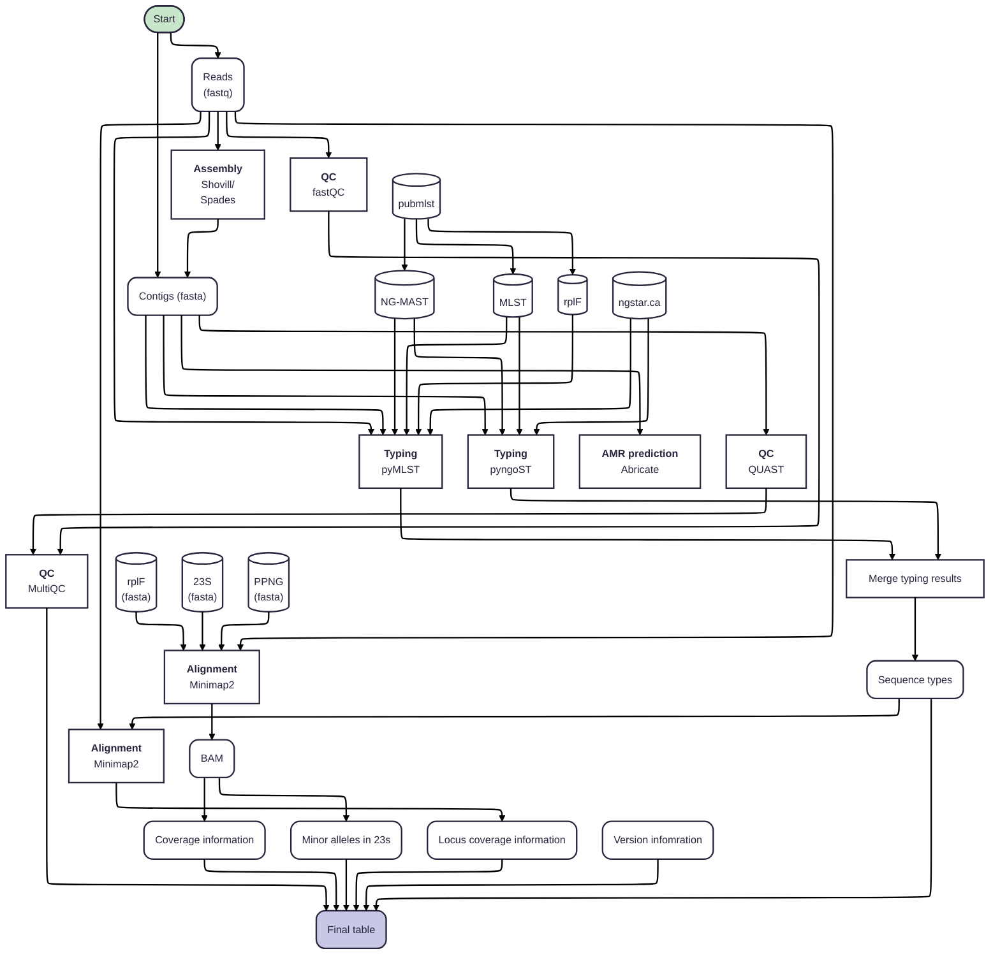

# ngpipe
 
ngpipe is a pipeline for typing _Neisseria gonorrhoeae_.
It takes a folder of reads or contigs and runs sequence typing for MLST, NG-STAR and NG-MAST typing.
It also determines species using the rplF gene and checks for the presence of rplF and ppng.
It will compile this information into a table and create a minimum spanning tree using MLST.

## Installation

Clone this repository

```git clone https://github.com/mjsull/ngpipe.git```

## Requirements
### Essential
#### Python
#### networkx
#### matplotlib
#### Snakemake - https://github.com/snakemake/snakemake
#### pyngoST
#### Minimap
#### Samtools
#### Shovill
#### pymlst


### Optional
#### Abricate
#### FastQC
#### QUAST

## Usage

#### To run ngpipe on a list of contigs
1. Create text file /path/to/samples.txt
2. Enter a list of samples to process, one on each line.
3. create directory /path/to/contigs
4. For each sample copy a FASTA of contigs to ```/path/to/contigs/<sample>.fasta```
5. __Run__

```snakemake --snakefile ngpipe/Snakefile --config workdir=/path/to/output contig_dir=/path/to/contigs  samples=/path/to/samples.txt  --cores 4```

#### To run ngpipe on a folder of Illumina reads
1. Create text file /path/to/samples.txt
2. Enter a list of samples to process, one on each line.
3. create directory /path/to/reads
4. For each sample copy read pairs to to ```/path/to/reads/<sample>_R1.fastq.gz``` and ```/path/to/reads/<sample>_R2.fastq.gz```
5. __Run__

```snakemake --snakefile ngpipe/Snakefile --config workdir=/path/to/output read_dir=/path/to/reads  samples=/path/to/samples.txt  --cores 4```


## Implementation

